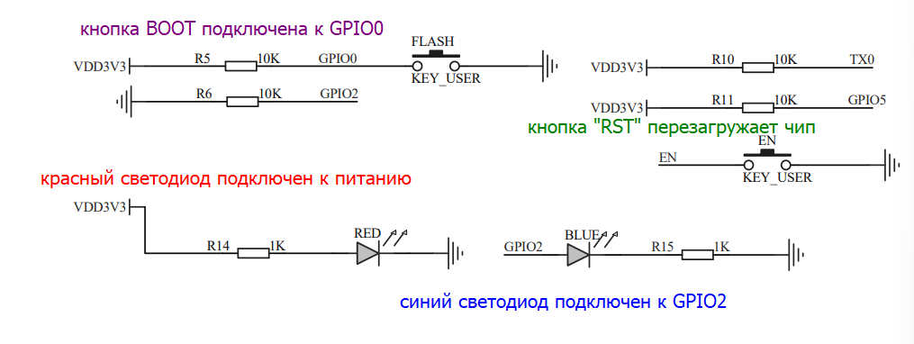

## 1.1. Мигаем встроенным светодиодом

**Задача:** помигать светодиодом, расположенным на отладочной плате ESP32.

### Выясняем номер пина

У каждого пина микроконтроллера есть свой номер. Ножки обычно подписаны на плате, например, D5 означает, что это **D**igital пин с номером 5. Как узнать пин чего-то, что распаяно на светодиоде? Наиболее надёжный способ - найти светодиод на схеме платы (гуглим что-то типа "esp32 devkit schematics") и посмотреть, к чему он подключен. Возьмём схему платы [отсюда](https://wiki.amperka.ru/_media/products:esp32-wroom-wifi-devkit-v1:esp32-wroom-wifi-devkit-v1_schematic.pdf):



Для удобства, пины встроенных светодиодов и кнопок отладочных плат, обитающих в хакспейсе, приведены ниже.

| Отладочная плата        | Пин светодиода | Пин кнопки |
| ----------------------- | -------------- | ---------- |
| ESP32 DevKit            | 2              | 0          |
| Lolin S2 Mini (ESP32S2) | 15             | 0          |
| LuatOS ESP32C3-CORE     | 12, 13         | 9          |

### Конфигурируем пин на выход

Для работы с цифровыми пинами импортируем модуль [digitalio](https://docs.circuitpython.org/en/latest/shared-bindings/digitalio/), а для обращения к пинам по их номеру - модуль `board`. Также здесь и в 99% других проектов мы планируем много спать, поэтому нам пригодится модуль [time](https://docs.circuitpython.org/en/latest/shared-bindings/time/index.html).

```python
import digitalio, board, time
```

Чтобы использовать пин, мы оборачиваем его в объект `DigitalInOut` и устанавливаем режим работы `OUTPUT`:

```python
led = digitalio.DigitalInOut(board.IO2)
led.direction = digitalio.Direction.OUTPUT
```

<Warning>В зависимости от версии CircuitPython (у каждой отладочной платы она своя), вместо `board.IO2` придётся подставить `board.D2` или что-то подобное. Как проверить названия пинов? Напишите в скрипте `print(dir(board))` или в REPL-консоли импортируйте `board` и понажимайте клавишу Tab после ввода `board.`, чтобы увидеть список всех доступных пинов.</Warning>

Теперь мы можем устанавливать этому пину значения `True` (высокий сигнал, 3.3V) или `False` (низкий сигнал, 0V), таким образом включая или выключая светодиод:

```python
while True:
    led.value = True
    time.sleep(1)
    led.value = False
    time.sleep(1)
```

<Note>Мы используем бесконечный цикл, потому что, в отличие от обычных программ на ПК, если закончить выполнять прошивку, микроконтроллер перезагрузится и начнёт исполнять её снова. В CircuitPython вместо перезагрузки вас выкинет в REPL консоль питона и скрипт перестанет исполняться. Короче, в 99% проектов вы будете делать две вещи: `time.sleep` и бесконечный цикл.</Note>

Если после сохранения скрипта ваша отладочная плата начала мигать - значит всё прошло успешно и можно переходить к следующей задаче. Если нет - изучите консоль на предмет ошибок.

## 1.2. Включаем светодиод по кнопке

**Задача:** если нажата кнопка - включить светодиод, если не нажата - выключить.

В дополнение к переменной `led`, создаём ещё одну переменную `button` с ещё одним `DigitalInOut`, но передаём номер пина встроенной кнопки (см. таблицу выше). Пин кнопки мы конфигурируем в `INPUT` для чтения значения. Инициализацию всех пинов мы делаем перед основным циклом!

Основной цикл у нас будет выглядеть так:

```python
while True:
    led.value = button.value
    time.sleep(0.05)
```

Здесь мы спим, чтобы не загружать процессор, но при этом спим достаточно мало, чтобы задержка была незаметна нашему глазу.

**Дополнительные задачи:**
- пофиксить основной цикл, чтобы при нажатии кнопки светодиод включался, а не выключался
- придумать алгоритм, чтобы при нажатии кнопки светодиод инвертировал состояние и оставался таким до следующего нажатия кнопки

## 1.3. Внешняя кнопка

**Задача:** оставить скрипт от прошлой задачи, но поменять встроенную кнопку на внешнюю.

TODO

## 1.4. Внешний светодиод

**Задача:** оставить скрипт от прошлой задачи, но поменять встроенный светодиод на внешний.