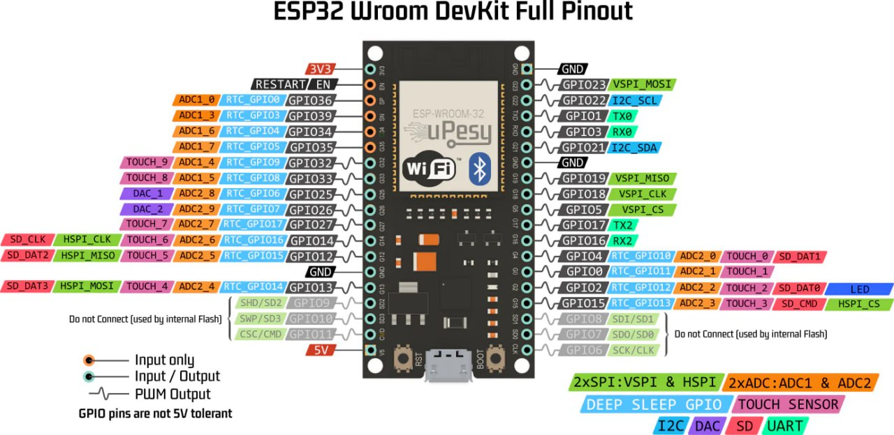
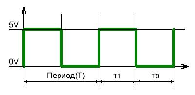
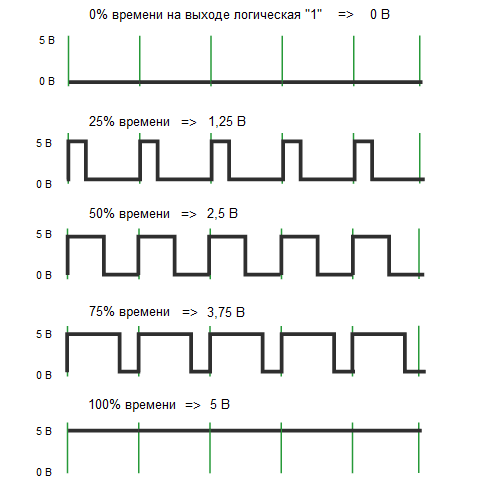

В этой части будет нужно подглядывать в схему отладочной платы:



## 2.1. Яркость светодиода (программно)

**Задача:** сделать, чтобы светодиод светился тускло (30-50% от обычной яркости).


Для того, чтобы получить тусклый для человеческого глаза свет, мы не можем подавать произвольное постоянное напряжение на светодиод, т. к. он может находиться всего в 2-х состояниях:

 ```led.value = True``` - подаём 3.3 вольта, яркость максимальная 

 ```led.value = False``` - не подаём напряжение, лампочка не горит

Выход - чередовать подачу и отключение напряжения на светодиоде так, чтобы:

а) Для человеческого глаза мерцание казалось бесшовным (для этого значение **периода** быть достаточно коротким)

б) Доля времени, в течение которого подаётся напряжение, была небольшой, что воспринимается как меньшая яркость.



Из рисунка видно что сигнал на некоторое время остается поочередно на низком и высоком уровне. `Т0` - низкий , `Т1` - высокий. Период сигнала будет равен `Т = Т0+Т1`. 



Здесь полезно будет знать про *коэффициент заполнения, он же - величина рабочего цикла (duty cycle)*. Он равен `T1/T * 100%`. 

Чем больше коэффициент заполнения, тем больше напряжение на выходе. 

Возьмём в качестве значения периода `T = 10 мс`. Остаётся выявить нужное время задержек при включенном (Т1) и выключенном (Т0) светодиоде:

```python
    led.value = True
    time.sleep(0.001)
    led.value = False
    time.sleep(0.009)

```

## 2.2. Яркость светодиода (аппаратно)

**Задача:** сделать, чтобы светодиод менял яркость от 0% до 100% и обратно.

Генерировать ШИМ вручную - не лучший вариант из-за нагрузки на процессор, блокировки другого кода и плохой масштабируемости. Решением для нас будет использование аппаратного ШИМа (того, что уже есть в микроконтроллере). От нас потребуется настроить параметры, а периферия микроконтроллера сама сгенерирует сигнал.

Для доступа к хардварному ШИМу воспользуемся модулем [pwmio](https://docs.circuitpython.org/en/latest/shared-bindings/pwmio/). 

Создаём объект `PWMOut`, который будет генерировать сигнал на заданном пине (предварительно проверьте, что на выбранном пине есть ШИМ при помощи схемы распиновки платы) с нужной частотой и коэффициентом заполнения:

```python
pwm = pwmio.PWMOut(board.IO32, frequency=500, duty_cycle=0)
```

`frequency` — частота ШИМ сигнала с 32-битным диапазоном, по умолчанию равна 500 Гц.

`duty_cycle` — коэффициент заполнения с 16-битным диапазоном, по умолчанию равен 0.


Чтобы менять коэффициент заполнения в ходе программы, достаточно присвоить свойству `duty_cycle` созданного объекта нужное значение, например:

```python
pwm.duty_cycle = 32767 # 2**15-1
```

Тогда для решения задачи необходимо постепенно менять значение коэффициента заполнения от `0` до `2**16 = 65535` и обратно. 

## 2.3. Потенциометр

**Задача:** ручка потенциометра задаёт яркость светодиода.

Мы уже знаем, как управлять яркостью светодиода с помощью ШИМ, но ещё хотелось бы регулировать её вручную при помощи внешнего компонента. Тут нам на помощь и приходит потенциометр - переменный резистор (aka крутилка)

### Подключаем потенциометр

Потенциометр подсоединяется крайними выводами к `GND` и `VCC`, а центральным – к *аналоговому* входу микроконтроллера в режиме `INPUT`. Найти аналоговый вход можно при помощи схемы отладочной платы.

Нас интересуют контакты `ADC*`, которые как раз используются для подключения аналоговых входов. Для конкретно входа используются пины, выделенные оранжевым на схеме. 

Чтобы работать с аналоговыми входами импортируем в программу модуль [analogio](https://docs.circuitpython.org/en/latest/shared-bindings/analogio/index.html). 

Теперь создадим объект `AnalogIn` и подключим его к пину, в который мы подрубили потенциометр.

```python
potentiometer = analogio.AnalogIn(board.I35)
```
Осталось связать значение потенциометра `potentiometer.value` с коэффицентом заполнения для светодиода. Для удобства можно выводить значение на потенциометре в терминал.

## 2.4. Синтезатор

**Задача:** крутилка (потенциометр) плавно меняет частоту писка. Кнопка стоит **в разрыв пищалки** и просто физически включает/выключает звук.

### Что понадобится

* ESP32 с CircuitPython
* **Пассивная** пищалка / пьезо (важно!)
* Потенциометр (например 10k)
* Кнопка
* Breadboard + провода

### Подключение

#### Потенциометр

* крайняя ножка → `3V3`
* другая крайняя ножка → `GND`
* средняя ножка (ползунок) → **аналоговый вход** ESP32 (любой ADC-пин, см. распиновку)

#### Пищалка + кнопка “в разрыв”

Идея: PWM-пин генерирует сигнал, но пищалка реально звучит только когда цепь замкнута кнопкой.

Вариант подключения:

* `PWM-пин` → **кнопка** → “+” пищалки
* “−” пищалки → `GND`

То есть кнопка стоит **последовательно** между PWM и пищалкой.

> Если пищалка без “+/-” (просто два вывода) — неважно, какой куда.

### Код (минимальный)

```python
import time
import board
import analogio
import pwmio

# Пины: поменяй под свою плату при необходимости
POT_PIN = board.I35      # аналоговый вход (ADC)
BUZZER_PIN = board.IO25  # PWM-пин для пищалки

pot = analogio.AnalogIn(POT_PIN)

# Стартуем с какой-то частоты, duty_cycle ~50% чтобы пищалка звучала
buzzer = pwmio.PWMOut(BUZZER_PIN, frequency=440, duty_cycle=32768)

# Диапазон частот (подбирай под свою пищалку)
F_MIN = 100
F_MAX = 4000

try:
    while True:
        v = pot.value  # 0..65535

        # Линейно маппим 0..65535 -> F_MIN..F_MAX
        freq = F_MIN + (v * (F_MAX - F_MIN)) // 65535

        # Применяем
        buzzer.frequency = int(freq)

        # Небольшая задержка, чтобы не дергать PWM слишком часто
        time.sleep(0.01)

finally:
    buzzer.deinit()
    pot.deinit()
```


