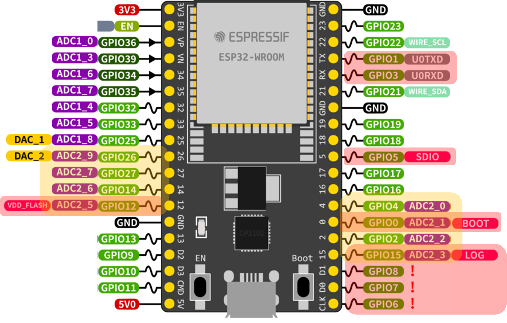
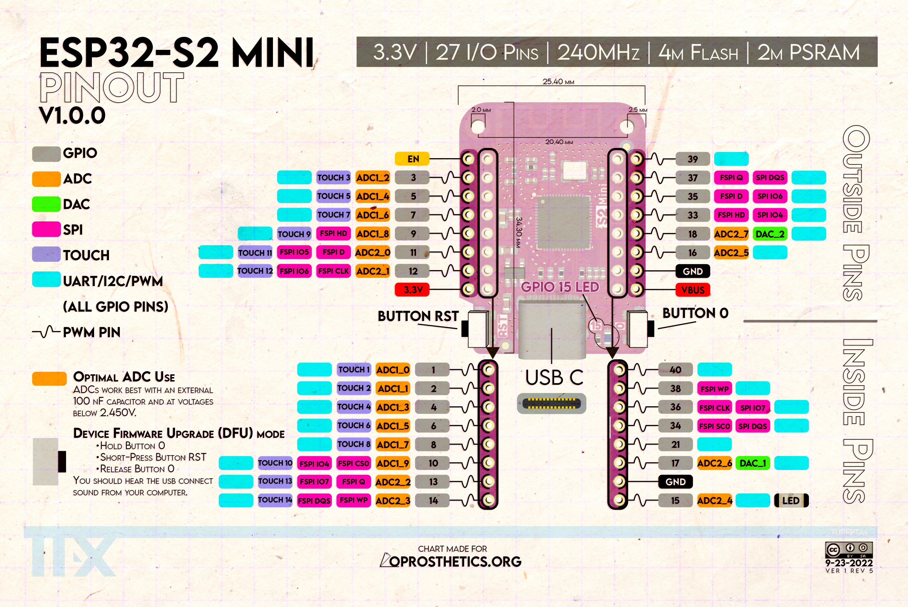
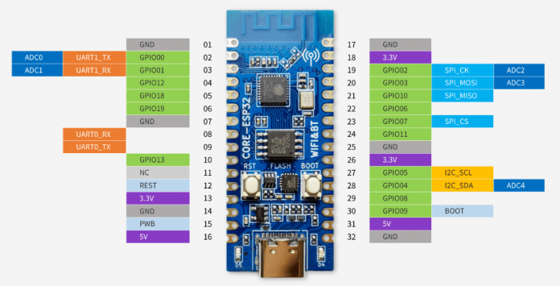

---
title: "Гайд по ESP32, CircuitPython и периферии"
---

Гайд по установке и небольшой каталог существующей в хакспейсе периферии с примерами использования (и описанием подводных камней, если они есть).

# Доки по периферии

<CardGroup cols={2}>
  <Card
    title="DHT11, DHT22 — температура и влажность"
    href="/esp32/peripherals/dht11-dht22"
    img="./peripherals/dht11-dht22-temperatura-i-vlazhnost.png"
  />
  <Card
    title="HC-SR04 — измерение расстояния (сонар)"
    href="/esp32/peripherals/hc-sr04"
    img="./peripherals/hc-sr04-izmerenie-rasstoyaniya-sonar.png"
  />
  <Card
    title="MQ-135 — датчик CO2"
    href="/esp32/peripherals/mq-135"
    img="./peripherals/mq-135-datchik-co2.png"
  />
  <Card
    title="RGB-светодиод"
    href="/esp32/peripherals/rgb-led"
    img="./peripherals/rgb-led-rgb-svetodiod.png"
  />
  <Card
    title="Клавиатура"
    href="/esp32/peripherals/keyboard"
    img="./peripherals/keyboard-klaviatura.png"
  />
  <Card
    title="Джойстик"
    href="/esp32/peripherals/joystick"
    img="./peripherals/joystick-dzhoystik.png"
  />
  <Card
    title="Telegram-уведомления"
    href="/esp32/peripherals/telegram"
    img="./peripherals/telegram-uvedomleniya.png"
  />
  <Card
    title="Пассивная пищалка"
    href="/esp32/peripherals/passive-buzzer"
    img="./peripherals/passive-buzzer-passivnaya-pishchalka.png"
  />
  <Card
    title="Пульсометр"
    href="/esp32/peripherals/pulse-meter"
    img="./peripherals/pulse-meter-pulsometr.png"
  />
  <Card
    title="Экран RG1602A + плата расширения PCF8574"
    href="/esp32/peripherals/lcd-rg1602a-pcf8574"
    img="./peripherals/lcd-rg1602a-pcf8574-photo-2023-10-17-19-28-33-jpg.jpg"
  />
</CardGroup>

# Идеи проектов

1. считывать показания датчиков, выводить:
    1. в телеграм
    2. на экранчик
    3. сигнализировать влажность RGB-светодиодом (подышать чтобы повысилась)
    4. пищать определённым тоном в зависимости от влажности (подышать чтобы повысилась)
2. музыкальный инструмент: с помощью сонара измерять расстояние, менять частоту пищалки в зависимости от текущего расстояния
3. музыкальный инструмент: подключить блок кнопок и играть ноты пищалкой при нажатии на кнопки
    1. (сложно!) подключить несколько пищалок и добавить возможность играть аккорды
4. просто музыка: с помощью пищалки играть прикольные мелодии
    1. можно ещё заставить ргб-светодиод менять цвет в соответствии с текущей нотой
5. ачивка: устройте джем-сессию на самодельных музыкальных инструментах
6. управление джойстиком:
    1. поворачивать сервомотор вслед за джойстиком
    2. управлять цветом ргб-светодиода с помощью джойстика
    3. управлять тоном пищалки с помощью джойстика
7. пульсометр: мигать лампочкой, пищать пищалкой в такт пульса
    1. сложно: вместо дискретных ударов сердца использовать прям всю синусоиду

# Быстрый обзор ESP32

ESP8266 — очень старый слабый чип, не умеет в питон

ESP32 — чип поновее и помощнее, умеет Wi-Fi+Bluetooth, не умеет прикидываться флешкой

ESP32-S2 — самые дешманские отладочные платы (170 рублей), не умеет Bluetooth, умеет прикидываться флешкой

ESP32-C3 — самый новый чип, архитектура RISC-V (против Xtensa у всех остальных), поэтому не требует форков компиляторов, умеет прикидываться флешкой

# Установка CircuitPython

<Note>
💡 Если вы нашли в хакспейсе отладочную плату, скорее всего на ней уже стоит CircuitPython, попробуйте проверить: запитайте микроконтроллер и откройте [http://circuitpython.local/code/](http://circuitpython.local/code/) (все ESP32 броадкастят свои адреса по mDNS).

</Note>

Втыкаем отладочную плату в комп, переходим в режим прошивки:

1. Зажимаем кнопку BOOT (она может быть непонятно подписана, тогда ищем RST и зажимаем ДРУГУЮ кнопку)
2. Нажимаем и отпускаем RST
3. Отпускаем BOOT

Плата должна распознаться как usb-to-uart конвертер.

Дальше идём сюда:

[CircuitPython - Downloads](https://circuitpython.org/downloads)

Нажимаем Filters и выбираем наш чип. Находим визуально похожую плату.

Нажимаем Open Installer. Жмём “Full CircuitPython 8.x.x Install”, следуем инструкциям.

## Как пользоваться

### Вариант 1 — если не умеет прикидываться флешкой

После установки прошивки не появилось флешки CIRCUITPY на компе? Открываем [http://circuitpython.local/code/](http://circuitpython.local/code/) (это mDNS адрес, его броадкастит микроконтроллер). Жмякаем full code editor. Снизу тыкаем Serial, теперь слева у нас код, а справа вывод консоли. Код пишется в code.py или main.py, контроллер автоматически запускает их при старте.

### Вариант 2 — если флешка появилась

Открываем Visual Studio Code, ставим [расширение CircuitPython](https://marketplace.visualstudio.com/items?itemName=joedevivo.vscode-circuitpython), снизу выбираем свою борду (прошивку для которой вы ставили с сайта circuitpython) и серийный порт (методом исключения а также сравнения списка с подключенной платой и без неё). Снизу откроется консоль. Редактор будет подсказывать подсказки как в обычном питоне (только у меня он почему-то ругался на имя файла code.py, поэтому я переименовал его в main.py).

Бонус: установка библиотек.

```bash
pip install circup
circup install adafruit_pn532  # вот так можно быстро поставить библиотеку
```

# Продвинутые штучки

## Распиновка

### ESP32



красные и желтые не юзаем. порядок пинов может отличаться, но функционал будет одинаковым вне зависимости от отладочной платы

1 и 3 — uart (можно случайно мусор словить)

6-11 — флеш-память (хз зачем её вывели наружу)

12-15 — jtag

16-17 — флеш-память

34-39 — input-only, с них спокойно можно читать инфу, писать нельзя

под аналоговые входы нужно юзать 32-39 (это пины ADC1, ADC2 занят вайфаем)

### ESP32-S2



### ESP32-C3



## Отличия прошивок CircuitPython

Идём в [гитхаб](https://github.com/adafruit/circuitpython/tree/main/ports/espressif/boards), тыкаем интересующую плату и смотрим файлики (их там обычно мало). Самое главное это `mpconfigboard.h`, в нём прописывается, какие пины чипа на какие устройства на плате распаяны. Например, `#define MICROPY_HW_LED_STATUS (&pin_GPIO13)` означает, что на ноге микроконтроллера GPIO13 прошивка ожидает светодиод, которым будет мигать при каких-то своих событиях (например, подключении к вайфаю).
