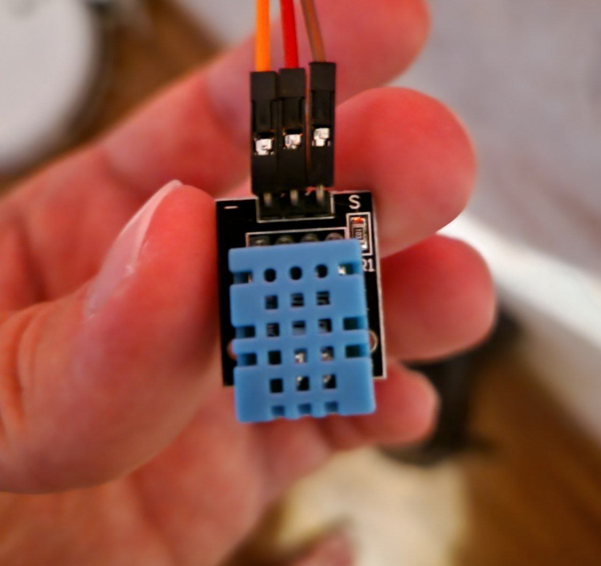

---
title: "DHT11, DHT22 - температура и влажность"
---

# DHT11, DHT22 - температура и влажность

Created: October 18, 2023 10:22 PM
Tags: ввод



Умеет считывать температуру и влажность. DHT22 более точный, чем DHT11. 

# Подключение

DHT11 / DHT22 → ESP32

S → D15 (любой цифровой пин)

+ → 3v3

- → GND

# Пример

Используется библиотека adafruit_dht.

```python
import board
import adafruit_dht

dht = adafruit_dht.DHT11(board.D15)
print("temperature", dht.temperature)
print("humidity", dht.humidity)
```

# Подводные камни

Используется 1-wire протокол, который считается устаревшим из-за того, что в софте приходится писать много костылей. Вместо этих датчиков рекомендуется использовать те которые работают на шине I2C. 

При горячей перезагрузке (при сохранении кода) библиотека может не обнаруживать этот датчик по непонятным причинам. Фиксится перезагрузкой по кнопке RST.
