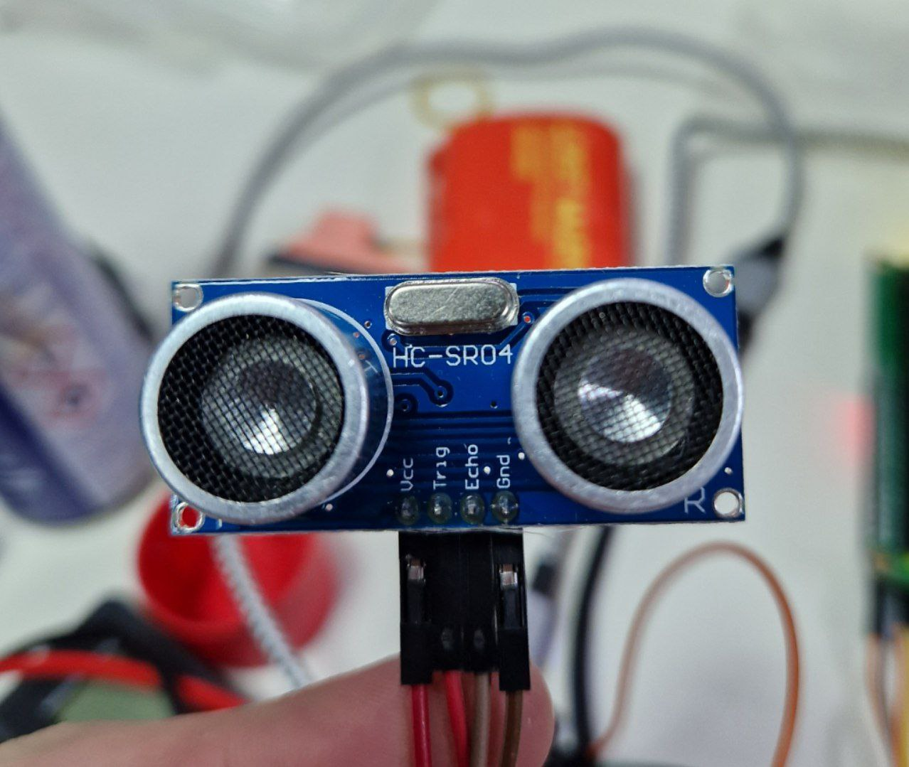

---
title: "HC-SR04 — измерение расстояния (сонар)"
---

# HC-SR04 — измерение расстояния (сонар)

Created: October 22, 2023 4:51 PM
Tags: ввод



Ультразвуковой сонар позволяет измерять расстояние от нескольких сантиметров до нескольких метров.

# Подключение

**HC-SR04 → ESP32**

Vcc → VIN/5V

Trig → IO7 (любой цифровой пин)

Echo → IO9 (любой цифровой пин)

Gnd → GND

# Пример

Используется библиотека adafruit_hcsr04.

```python
import adafruit_hcsr04
import board, time 

# таймаут влияет на максимальную дистанцию для измерения
sonar = adafruit_hcsr04.HCSR04(trigger_pin=board.IO7, echo_pin=board.IO9, timeout=1)

while True:
    try:
        print("Distance is", sonar.distance, "cm")
    except Exception as e:
        # sonar.distance выбрасывает таймаут, если мы
        # не поймали звук от объекта обратно (дистанция слишком большая)
        print(e)
    time.sleep(0.1)
```

# Подводные камни

Почему-то всегда таймаутится при горячей перезагрузке, нужно нажимать RST на плате.
