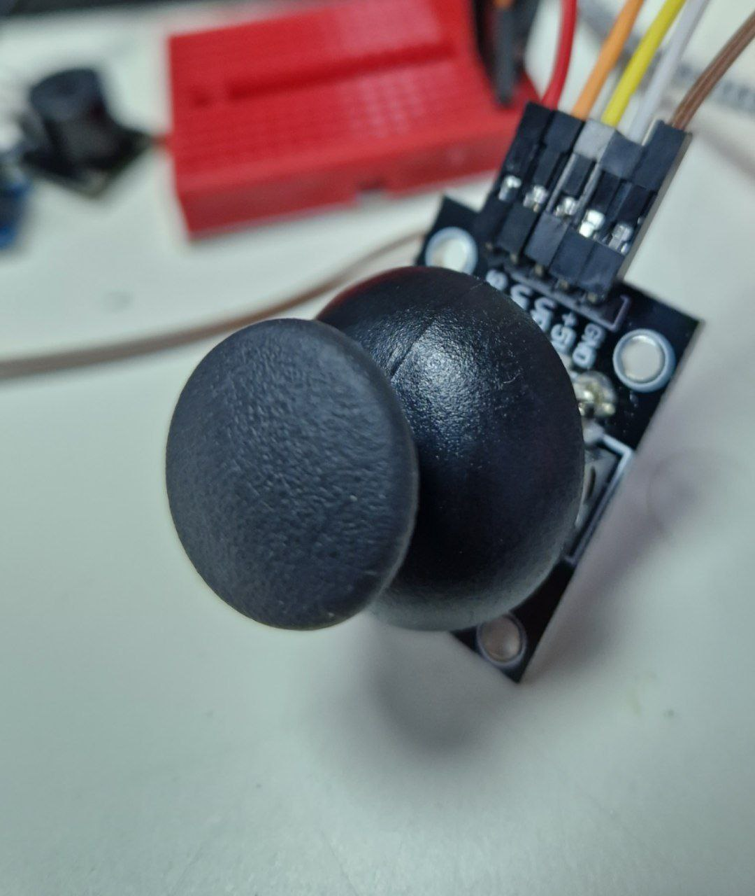
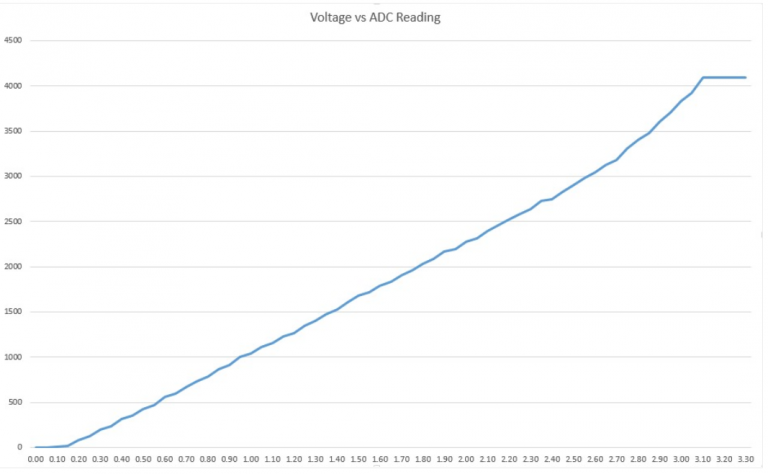

---
title: "Джойстик"
---

# Джойстик

Created: October 23, 2023 12:53 AM
Tags: ввод



Умеет считывать угол поворота по двум осям. На него можно нажимать, кнопка дискретная (0 или 1).

# Подключение

Обратите внимание, что этот джойстик под Arduino с АЦП под 5 вольт. В ESP32 мы будем подключать его к 3.3V, так как АЦП не поддерживает напряжение выше.

**Джойстик → ESP32**

SW → IO5 (любой цифровой пин)

VRy → IO7 (любой аналоговый пин)

VRx → IO9 (любой аналоговый пин)

+5V → 3V3 (!!!)

GND → GND

# Пример

```python
import board
import analogio
import digitalio
import time

button = digitalio.DigitalInOut(board.IO5)
button.direction = digitalio.Direction.INPUT
button.pull = digitalio.Pull.UP

vrx = analogio.AnalogIn(board.IO9)
vry = analogio.AnalogIn(board.IO7)

while True:
    # кнопка возвращает False если не нажата
    # vrx и vry возвращают значение от 0 до 65535
    # (по факту до 51 тысячи примерно)
    print("x:", vrx.value, "y:", vry.value, "btn:", button.value)
    time.sleep(0.1)
```

# Подводные камни

В крайних положениях перемещение джойстика регистрируется плохо. В мануалах по ESP32 говорится, что АЦП плохо различает напряжения, близкие к нулю или 3.3 В. Возможно стоит использовать резисторы, чтобы напряжение джойстика изменялось от 0.2 до 3 В.

[ESP32 Analog Input with Arduino IDE | Random Nerd Tutorials](https://randomnerdtutorials.com/esp32-adc-analog-read-arduino-ide/)


