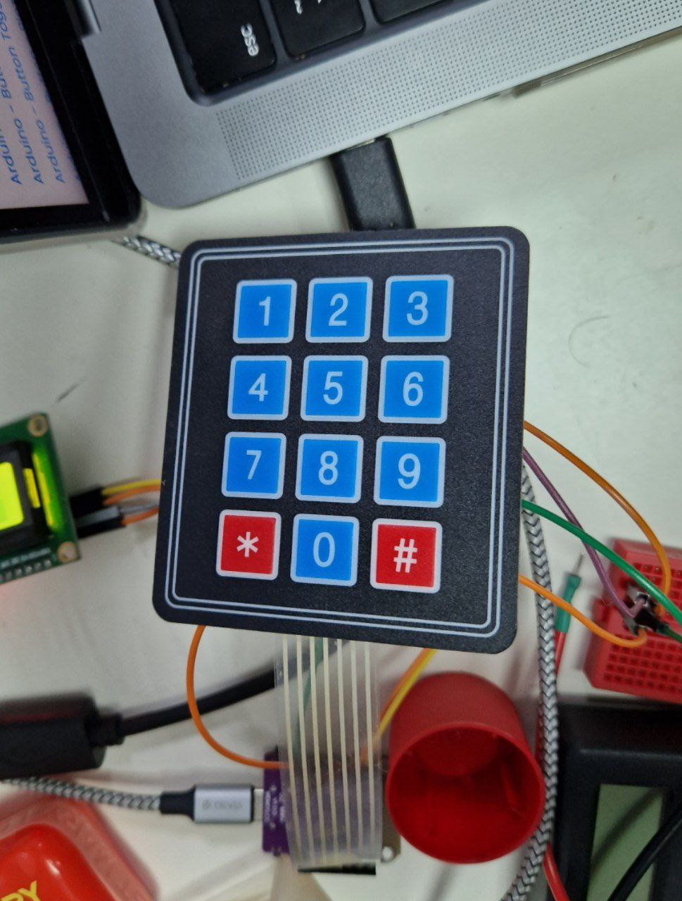

---
title: "Клавиатура"
---

# Клавиатура

Created: October 22, 2023 5:24 PM
Tags: ввод



# Подключение

Пины (слева направо): r1, r2, r3, r4, c5, c6, c7

Клавиатура → ESP32:

r1 → IO13

r2 → IO10

r3 → IO8

r4 → IO6

c1 → IO4

c2 → IO2

c3 → IO1

# Пример

```python
import board, time, digitalio

# массив пинов r1, r2, r3, r4 (строки клавиатуры)
rows = [digitalio.DigitalInOut(row) for row in [board.IO13, board.IO10, board.IO8, board.IO6]]

# массив пинов c1, c2, c3 (столбцы клавиатуры)
cols = [digitalio.DigitalInOut(col) for col in [board.IO4, board.IO2, board.IO1]]

# кнопки клавиатуры, функция scan будет возвращать их при нажатии
symbols = ["123", "456", "789", "*0#"]

# инициализируем пины r1..r4 на выход, по умолчанию у всех значение 1
for row in rows:
    row.direction = digitalio.Direction.OUTPUT
    row.value = True

# инициализируем пины c1..c3 на вход
for col in cols:
    col.direction = digitalio.Direction.INPUT
    col.pull = digitalio.Pull.UP

# функция сканирования клавиатуры
# возвращает строку с нажатыми символами (например "12#", "5" или "")
def scan_keyboard():
    pressed = ""
    for row, row_keys in zip(rows, symbols):
        # каждую строку поочерёдно устанавливаем в 0
        row.value = False
        for col, key in zip(cols, row_keys):
            # если в колонке тоже стал 0, значит кнопка 
            # на пересечении строки и столбца нажата
            if not col.value:
                pressed += key
        row.value = True
    return pressed

while True:
    print(scan_keyboard())
    time.sleep(0.1)
```

# Подводные камни

Несколько нажатий в одном столбце не распознаются.
