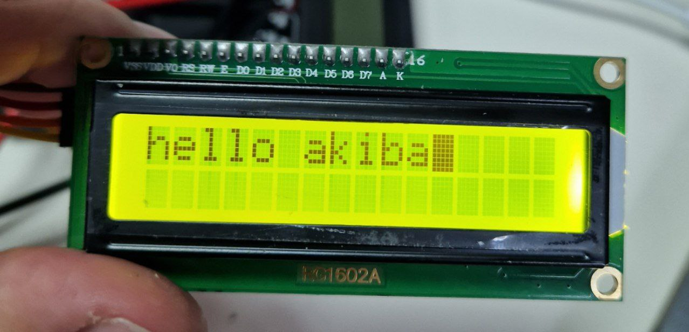
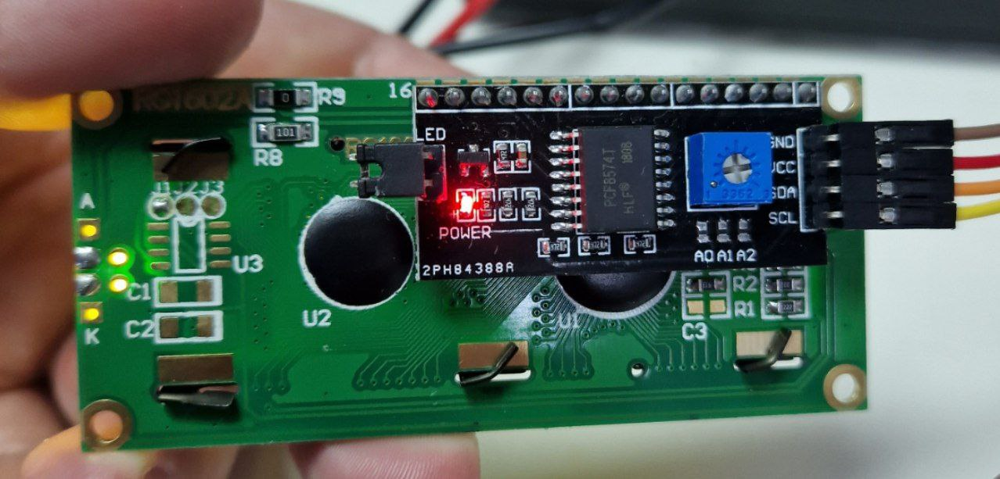

---
title: "Экран RG1602A + плата расширения PCF8574"
---

# Экран RG1602A + плата расширения PCF8574

Created: October 17, 2023 7:24 PM
Tags: вывод





Экран умеет выводить текст размером 16х2 символа. Можно подключить как напрямую к микроконтроллеру, так и через плату расширения GPIO, тогда к микроконтроллеру достаточно будет подключить только I2C шину.

# Подключение

PCF8574 → ESP32

GND → GND

VCC → VIN/5V

SDA → IO5 (любой цифровой пин)

SCL → IO3 (любой цифровой пин)

# Пример

Используются библиотеки adafruit_pcf8574 и adafruit_character_lcd.

```python
import board, busio
from adafruit_character_lcd.character_lcd import Character_LCD_Mono
import adafruit_pcf8574

i2c = busio.I2C(board.IO3, board.IO5)
pcf = adafruit_pcf8574.PCF8574(i2c, 0x27)

lcd = Character_LCD_Mono(
    pcf.get_pin(0), 
    pcf.get_pin(2), 
    pcf.get_pin(4), 
    pcf.get_pin(5), 
    pcf.get_pin(6), 
    pcf.get_pin(7),
    16, 2, 
    backlight_pin=pcf.get_pin(3))

lcd.message = "hello akiba"
lcd.backlight = True
lcd.blink = True
```
