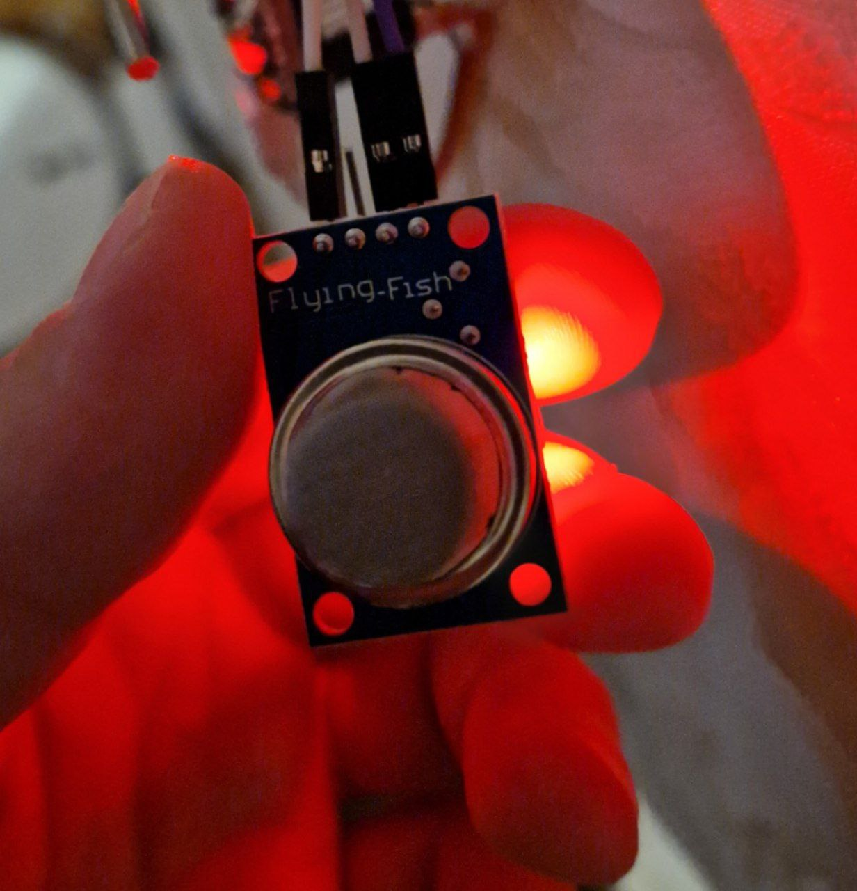
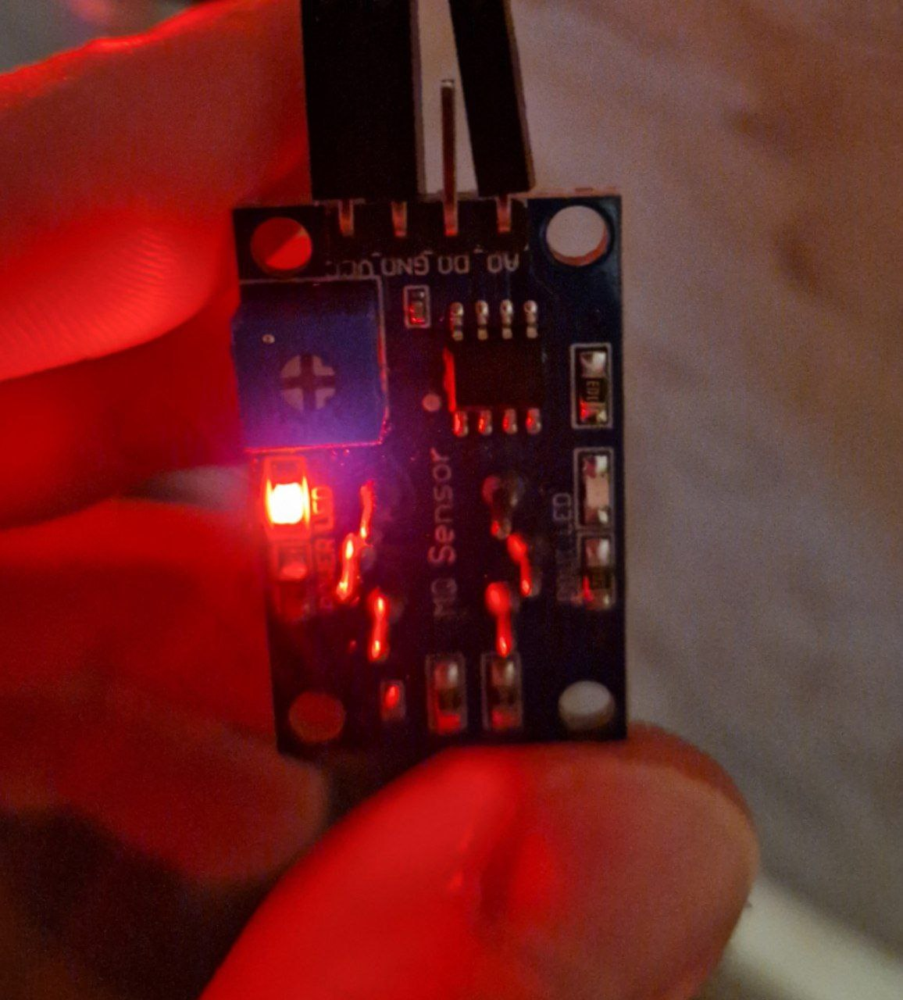

---
title: "MQ-135 — датчик CO2"
---

# MQ-135 — датчик CO2

Created: October 18, 2023 10:34 PM
Tags: ввод





Химрезистор, который позволяет примерно определить содержание углекислого газа в воздухе.

# Подключение

Обратите внимание, что пин A0 выдаёт текущее показание датчика, а D0 выдаёт 0 или 1 в зависимости от превышения заданного подстроечным резистором показателя (на плате распаян компаратор).

**MQ-135 → ESP32**

A0 → D35 (любой свободный аналоговый пин)

D0 → - (цифровой пин не используем)

GND → GND

VCC → VIN/5V

При первом использовании датчик должен прогреться в течение суток. Перед измерением датчик должен прогреваться в течение минуты, так как его рабочая температура — 45 градусов.

# Пример

```python
from mq135 import MQ135
import board

mq135 = MQ135(board.D35)
ppm = mq135.get_ppm()

# Если у нас есть температура и влажность с другого датчика,
# используем их для более точных показаний

# ppm = mq135.get_corrected_ppm(temp, hum)

print("PPM:", ppm)
```

Также нужно создать файл `mq135.py` (библиотека, немного переделанная под CircuitPython [отсюда](https://github.com/rubfi/MQ135/blob/master/mq135.py)):

```python
"""CircuitPython library for MQ-135 CO2 gas censor.
Based on Micropython library by rubfi, which is based
on Arduino Library developed by G.Krocker (Mad Frog Labs)
and the corrections from balk77 and ViliusKraujutis

More info:
    https://hackaday.io/project/3475-sniffing-trinket/log/12363-mq135-arduino-library
    https://github.com/ViliusKraujutis/MQ135
    https://github.com/balk77/MQ135
    https://github.com/rubfi/MQ135
"""

import math
import time
import analogio

class MQ135:
    """ Class for dealing with MQ13 Gas Sensors """
    # The load resistance on the board
    RLOAD = 10.0
    # Calibration resistance at atmospheric CO2 level
    RZERO = 76.63
    # Parameters for calculating ppm of CO2 from sensor resistance
    PARA = 116.6020682
    PARB = 2.769034857

    # Parameters to model temperature and humidity dependence
    CORA = 0.00035
    CORB = 0.02718
    CORC = 1.39538
    CORD = 0.0018
    CORE = -0.003333333
    CORF = -0.001923077
    CORG = 1.130128205

    # Atmospheric CO2 level for calibration purposes
    ATMOCO2 = 397.13

    def __init__(self, pin):
        self.pin = analogio.AnalogIn(pin)

    def get_correction_factor(self, temperature, humidity):
        """Calculates the correction factor for ambient air temperature and relative humidity

        Based on the linearization of the temperature dependency curve
        under and above 20 degrees Celsius, asuming a linear dependency on humidity,
        provided by Balk77 https://github.com/GeorgK/MQ135/pull/6/files
        """

        if temperature < 20:
            return self.CORA * temperature * temperature - self.CORB * temperature + self.CORC - (humidity - 33.) * self.CORD

        return self.CORE * temperature + self.CORF * humidity + self.CORG

    def get_resistance(self):
        """Returns the resistance of the sensor in kOhms // -1 if not value got in pin"""
        if self.pin.value == 0:
            return -1

        return (61722./self.pin.value - 1.) * self.RLOAD

    def get_corrected_resistance(self, temperature, humidity):
        """Gets the resistance of the sensor corrected for temperature/humidity"""
        return self.get_resistance()/ self.get_correction_factor(temperature, humidity)

    def get_ppm(self):
        """Returns the ppm of CO2 sensed (assuming only CO2 in the air)"""
        return self.PARA * math.pow((self.get_resistance()/ self.RZERO), -self.PARB)

    def get_corrected_ppm(self, temperature, humidity):
        """Returns the ppm of CO2 sensed (assuming only CO2 in the air)
        corrected for temperature/humidity"""
        return self.PARA * math.pow((self.get_corrected_resistance(temperature, humidity)/ self.RZERO), -self.PARB)

    def get_rzero(self):
        """Returns the resistance RZero of the sensor (in kOhms) for calibratioin purposes"""
        return self.get_resistance() * math.pow((self.ATMOCO2/self.PARA), (1./self.PARB))

    def get_corrected_rzero(self, temperature, humidity):
        """Returns the resistance RZero of the sensor (in kOhms) for calibration purposes
        corrected for temperature/humidity"""
        return self.get_corrected_resistance(temperature, humidity) * math.pow((self.ATMOCO2/self.PARA), (1./self.PARB))
```

# Подводные камни

Датчик выдаёт напряжение от 0 до 5 вольт на сигнальной ноге. Мы надеемся на то, что датчик не будет использоваться в экстремальных условиях и значения выше 3.3 вольт не будут достигнуты.
