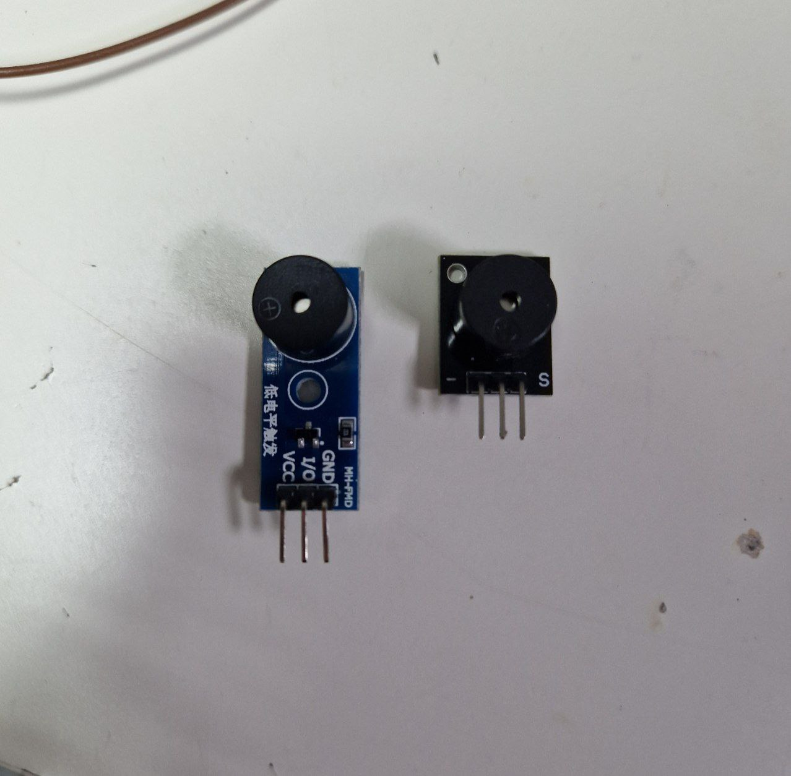

---
title: "Пассивная пищалка"
---

# Пассивная пищалка

Created: October 22, 2023 11:30 PM
Tags: вывод



Платы с пассивными пищалками бывают с усилением (есть транзистор, подписаны три ноги) и без усиления (три ноги, но припаяны только две). Ещё бывают активные пищалки, на них просто подаётся напряжение и они пищат (PWM не нужен).

# Подключение

**Пищалка → ESP32**

GND/- → GND

IO/S/+ → IO13 (любой цифровой пин)

*если с транзистором:*

VCC/+ → 3V3/VIN/5V (в зависимости от того насколько сильно вы хотите, чтобы от громкости страдали окружающие)

# Пример

```python
import board
import pwmio
import time

buzzer = pwmio.PWMOut(board.IO13, variable_frequency=True)

# duty-циклы для ШИМ: ON это 50%, OFF это 0%
SOUND_ON = 2**15
SOUND_OFF = 0

# будем пищать с частотой 600 герц
buzzer.frequency = 600
# включаем пищание
buzzer.duty_cycle = SOUND_ON
# пищим в течение секунды
time.sleep(1)
# перестаём пищать
buzzer.duty_cycle = SOUND_OFF
# не пищим 1 секунду во благо окружающих ушей
time.sleep(1)

#
# Более сложный пример: пищим "маленькую ёлочку"
#

# частоты нот
NOTES = {
    "C1": 262,
    "D1": 294,
    "E1": 330,
    "F1": 349,
    "G1": 392,
    "A1": 440,
    "B1": 494,
    "C2": 523
}

# длительность целой ноты
O = 2

def play(note, dur):
    buzzer.duty_cycle = SOUND_ON
    buzzer.frequency = NOTES[note]
    time.sleep(dur / 2)
    buzzer.duty_cycle = SOUND_OFF
    time.sleep(dur / 2)

p1 = [("G1", O/4), ("E1", O/8), ("E1", O/8)]
p2 = [("G1", O/8), ("F1", O/8), ("E1", O/8), ("D1", O/8), ("C1", O/4)]
p3 = [("A1", O/4), ("C2", O/8), ("A1", O/8)]

little_christmas_tree = p1 * 2 + p2 + p3 + p1 + p2 + p3 + p1 + p2

while True:
    for note, dur in little_christmas_tree:
        play(note, dur)
```

# Подводные камни

Если пищалка с транзистором, почему-то при выставлении duty_cycle в ноль звук всё равно остаётся (вероятно полностью нулевой сигнал на ШИМ невозможно получить, не знаю).
