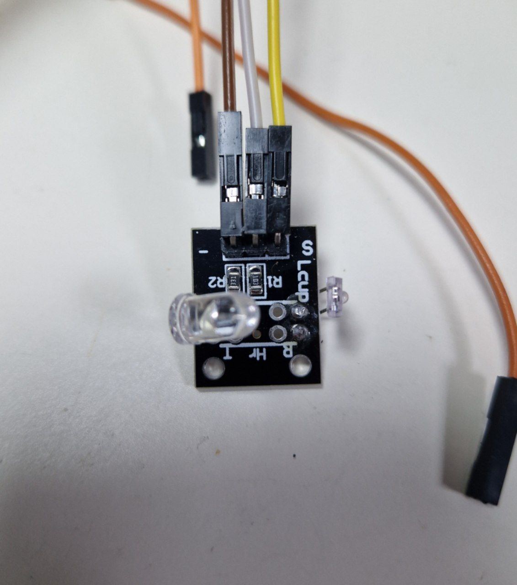

---
title: "Пульсометр"
---

# Пульсометр

Created: October 23, 2023 3:06 AM
Tags: ввод



Между инфракрасным светодиодом и фототранзистором помещается мизинчик (ногтём к светодиоду). Фототранзистор прижимается пальцем к столу (для того чтобы избавиться от помех). Если светодиод достаточно хорошо упёрт в палец, то фототранзистор будет регистрировать изменение потока света от ИК-светодиода из-за изменения давления крови в пальце.

# Подключение

**Пульсометр → ESP32**

S → IO9 (любой аналоговый вход)

Средний пин → 3.3V (максимальное напряжение АЦП у ESP32)

- → GND

# Пример

```python
# SPDX-FileCopyrightText: 2018 Kattni Rembor for Adafruit Industries; 2023 Vladimir Lebedev
#
# SPDX-License-Identifier: MIT

import board
import analogio
import time

pulse = analogio.AnalogIn(board.IO9)

# Сколько раз считываем показания подряд за один сэмпл
NUM_OVERSAMPLE = 10
# Сколько сэмплов усредняем
NUM_SAMPLES = 20
# Промежуток между сэмплами в секундах
SAMPLE_TIME = 0.025

# Кольцевой буфер для сэмплов
samples = [0] * NUM_SAMPLES

last_time = time.monotonic()
beats = 0

while True:
    for i in range(NUM_SAMPLES):
        # Считываем показания датчика максимально быстро
        oversample = 0
        for s in range(NUM_OVERSAMPLE):
            oversample += float(pulse.value)
        # ...и усредняем их
        samples[i] = oversample / NUM_OVERSAMPLE

        # Находим среднее среди всех снятых сэмплов
        mean = sum(samples) / float(len(samples))

        # Если в предыдущем сэмпле значение было меньше среднего,
        # а стало больше среднего - значит произошёл удар сердца
        if samples[i] - mean <= 0 and samples[i - 1] - mean > 0:
            beats += 1
            print('.', end='')

        # Каждые 10 секунд подсчитываем среднее количество ударов
        if time.monotonic() - last_time > 10:
            print()
            print("BPM:", beats * 60 / (time.monotonic() - last_time))
            beats = 0
            last_time = time.monotonic()

        time.sleep(SAMPLE_TIME)
```

Пример был переработан из статьи:

[Sensor Plotting with Mu and CircuitPython](https://learn.adafruit.com/sensor-plotting-with-mu-and-circuitpython/pulse)

QR на статью:


