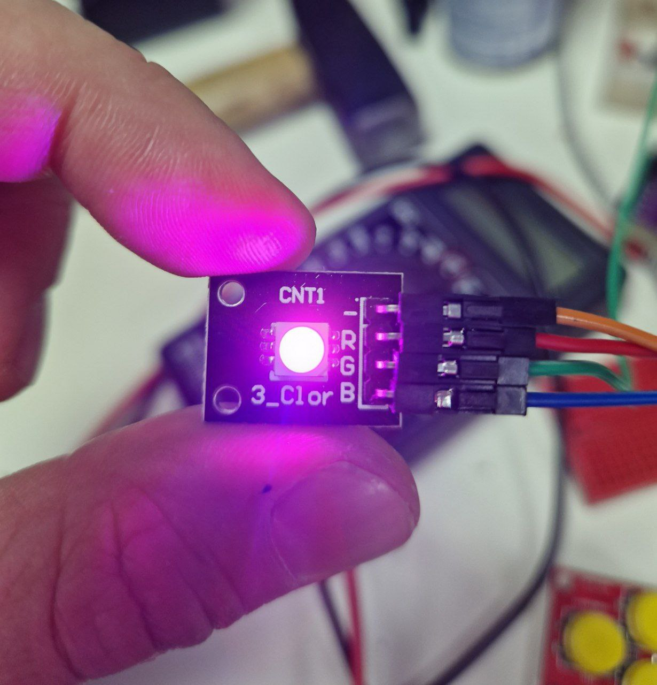

---
title: "RGB-светодиод"
---

# RGB-светодиод

Created: October 22, 2023 10:42 PM
Tags: вывод



Светодиод, который принимает 0 или 1 для включения или выключения каждого из своих каналов. Через ШИМ можно делать промежуточные состояния между 0 и 1 (менять интенсивность каждого канала).

# Подключение

**Светодиод → ESP32**

R → IO14 (любой цифровой пин)

G → IO13 (любой цифровой пин)

B → IO10 (любой цифровой пин)

- → GND

# Пример

```python
import board, time
import adafruit_rgbled

led = adafruit_rgbled.RGBLED(board.IO14, board.IO13, board.IO10)

# светить красным (255/255 красного, 0/255 зелёного и синего)
# https://ru.wikipedia.org/wiki/RGB
r, g, b = 255, 0, 0
led.color = r, g, b

# ниже более сложный пример:
# алгоритм для радуги

rainbow = [
    (255, 0, 0),
    (255, 255, 0), 
    (0, 255, 0),
    (0, 255, 255),
    (0, 0, 255),
    (255, 0, 255)
]

current_target = 1

# возвращает шаг изменения для каждого канала цвета
def d(c1, c2):
    if c2 > c1:
        return 1
    elif c1 > c2:
        return -1
    else:
        return 0

# возвращает новый цвет, который чуть ближе к с2, чем с1
def next_color(c1, c2):
    return (c1[i] + d(c1[i], c2[i]) for i in range(3))

# сравнивает все каналы двух цветов
def is_target_reached(c1, c2):
    return all(c1[i] == c2[i] for i in range(3))

while True:
    # если уже достигли текущей цели, идём к следующему шагу
    if is_target_reached((r, g, b), rainbow[current_target]):
        current_target = (current_target + 1) % len(rainbow)
    r, g, b = next_color((r, g, b), rainbow[current_target])
    led.color = (r, g, b)
    time.sleep(0.001)
```

# Подводные камни

По какой-то причине на хакспейсной плате со светодиодом перепутаны каналы R и G.

На “светофоре” (плате с красным, жёлтым и зелёным светодиодом) не работает жёлтый светодиод.

Тут пишут, что нужны резисторы:

[KY-009 RGB SMD-LED - SensorKit](https://sensorkit.joy-it.net/en/sensors/ky-009)
