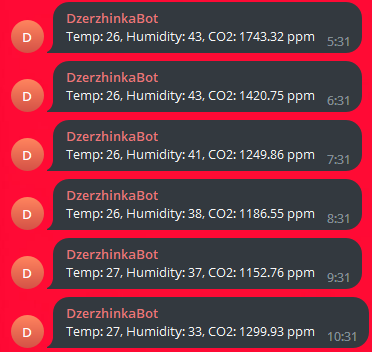

---
title: "Telegram-уведомления"
---

# Telegram-уведомления

Created: October 20, 2023 5:47 AM
Tags: вывод



Простейший способ присылать сообщения с ESP32 в Telegram.

# Подключение

1. Открываем BotFather:
    
    [BotFather](https://t.me/BotFather)
    
2. Пишем /newbot
3. В ответ на вопросы пишем имя бота и юзернейм (любые, какие хотите)
4. Когда закончили создание бота, в ответном сообщении BotFather напишет “… **Use this token to access the HTTP API:**”. Кликаем по токену, он скопируется (формат токена 123456789:KJHASFhhsdkjhakfsaj, не теряем то что слева или справа от двоеточия). С помощью этого токена можно писать от имени бота.
5. Выберите чат или канал для уведомлений (можно создать новый). Добавьте туда бота, в случае с каналом не забудьте дать ему права писать посты.
6. Чтобы бот мог писать в чат/канал, нам понадобится его юзернейм или id. Нажмите пкм по любому сообщению в чате/канале и выберите “Copy Link”. Если юзернейма нет, то ссылка будет выглядеть примерно так: `https://t.me/c/1172072679/2442`. ID чата/канала — это строка “-100”, сконкатенированная с первым числом в ссылке (в примере было `1172072679`, приписываем в начале -100, получаем -1001172072679).

# Пример

В примере используется библиотека adafruit_requests.

```python
import socketpool
import ssl
import adafruit_requests
import wifi

BOT_TOKEN = "123456789:AAbcdef-ghjkijs-ASDhjksd"
CHAT_ID = "-1001172072679"

pool = socketpool.SocketPool(wifi.radio)
requests = adafruit_requests.Session(pool, ssl.create_default_context())

requests.get("https://api.telegram.org/bot{}/sendMessage?chat_id={}&text=Hello%2C+world!".format(BOT_TOKEN, CHAT_ID))
```

Обратите внимание, текст сообщения должен быть в кодировке [urlencode](https://en.wikipedia.org/wiki/Percent-encoding). В отличие от обычного Python, в CircuitPython нет библиотек, которые реализуют эту кодировку. При необходимости её можно реализовать самостоятельно:

```python
def urlencode(message):
    return ''.join("%" + ("0" + hex(ord(x))[2:])[-2:] for x in message)
```
