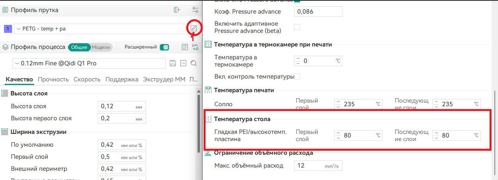
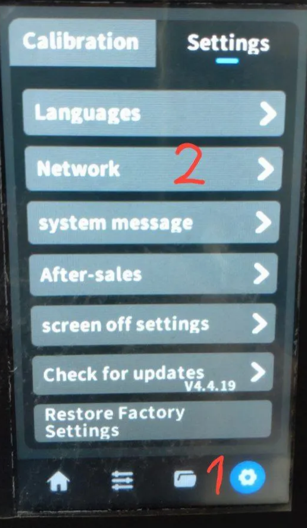
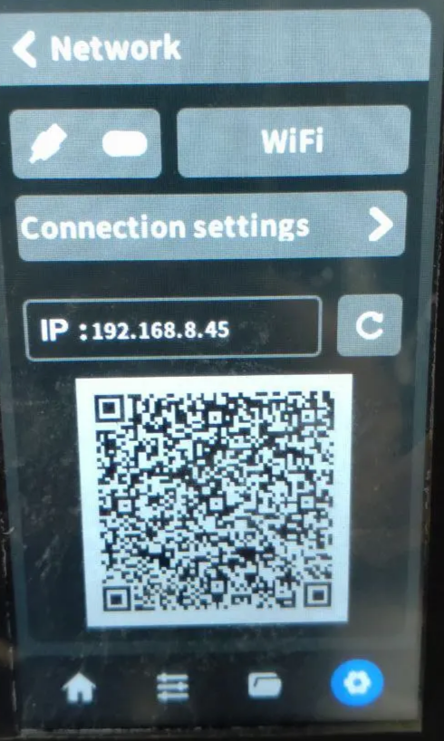
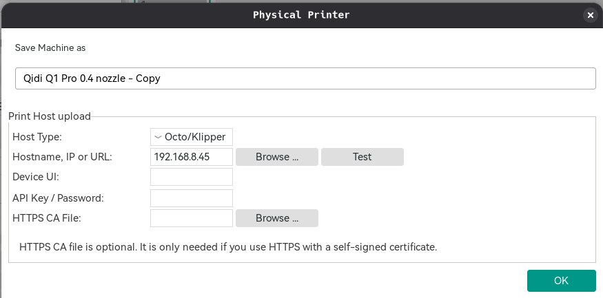
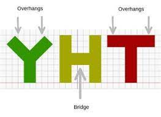
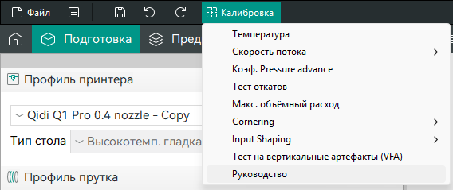
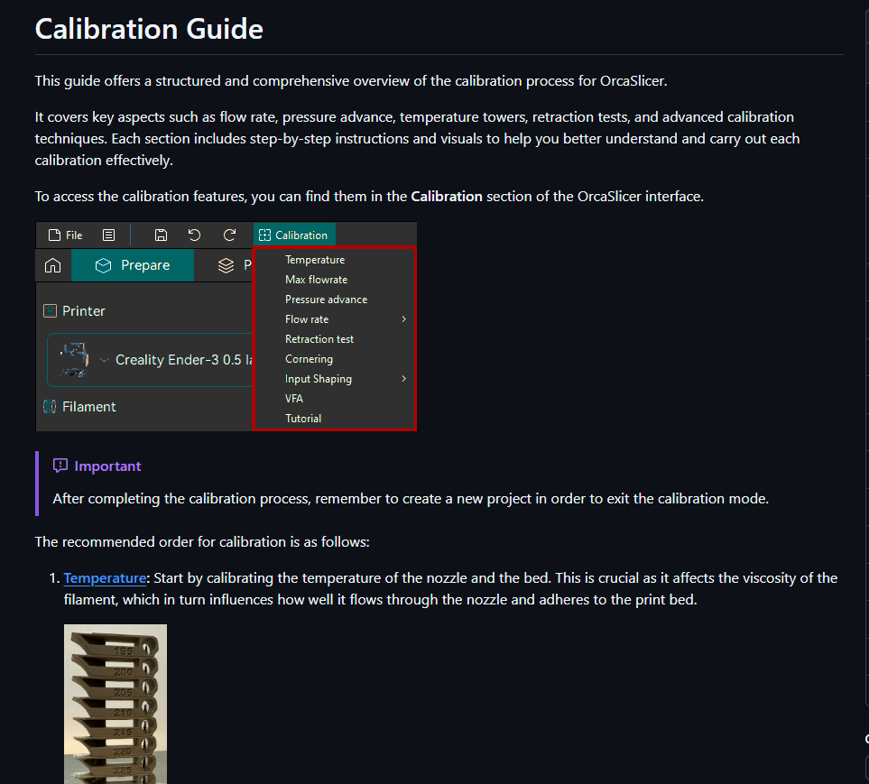

---
title: "3D-принтер"
---

# 3D-принтер

Наш принтер называется [QIDI Tech Q1-Pro](https://wiki.qidi3d.com/en/Q1-Pro). Он использует прошивку Klipper.

## 1. Как печатать

1. Замодельте модель в 3д-редакторе (Blender, Tinkercad, Fusion 360, etc.), либо найдите готовую в [каталогах](#8-готовые-модели-для-печати)
2. Скачайте [OrcaSlicer](https://github.com/SoftFever/OrcaSlicer). При первом запуске выбирете принтер Qidi Q1 Pro и  ширину сопла 0.4. Пластик любой.
3. Импортируйте актуальные конфиги. На данный момент, актуальный этот(вроде бы) Самый актуальный просите у Тимура
    - Конфиги
        
        Рома Лидер скинул 16.01.2026
        
        [3d-printer-config.orca_printer](https://raw.githubusercontent.com/akiba-hs/docs/refs/heads/main/infra/3d-printer-config.orca_printer)
        

Проверьте температуру кроватки. Не делайте её большой(Для PLA пластика оптимальна 60-65 градусов, для PETG 80 градусов)

1. Подпилите настройки под вашу модель ([советы ниже](#3-советы-по-слайсеру)), если надо включите поддержки(Support → Enable Support)
2. Перейдите в Preview чтобы запустить процесс слайсинга (нажать “нарезать стол”).  С помощью ползунка можем смотреть, как будет печататься модель послойно (проверяем, что всё устраивает и слайсер не ругается на нависания без поддержек), параллельно можно оценить в появившейся диаграмме время печати и расход пластика (если в конфиге указана плотность пластика и стоимость, но можно оценить массу модели и ее стоимость)
    
    
    
3. Нажимаем на значок Wi-Fi рядом с именем принтера
    
    
    
4. Устанавливаем корректный IP принтера
    1. Чтобы узнать ip принтера мы подходим к нему и переходим в настройки network
    
    
    
    
    

1. Когда всё готово нажимаем кнопку Print, перед этим необходимо очистить стол обезжиривателем.

## 2. Замена пластика

Я(@Alkekseevich) делаю вручную. на самом принтере ставлю температуру сопла 250 градусов и после того как прогреется вытягиваю пруток так же в меню на дисплее принтера. сматываю катушку, кладу назад в ящик с силикагелем и беру другой пластик. Обрезаю конец, пропихиваю через трубку и экструдирую пока не потечет нормальная нить.

## 3. Советы по слайсеру

### Как определить, нужны ли поддержки

Если у вас есть висящие области (за исключением мостов), берём в слайсере инструмент “рисование поддержек” и закрашиваем область, которая нависает. Если нависание параллельно столу и находится между опорами (как в случае посередине на картинке), то это мост и он печатается натягиванием линий пластика между опорами (поддержки не нужны). Если угол нависания не слишком большой (градусов до 45), то поддержка может и не понадобиться, пробуйте без поддержек.

### Прочность детали

Регулировать прочность детали можно количеством периметров (внешних оболочек модели), чем больше — тем прочнее модель. Если нужна прям жесть какая прочная деталь (шестерёнка для замка, например), то печатаем с максимальным заполнением — идём в настройки печати → заполнение → сплошное заполнение каждые: 1 слой.

## 4. Как сделать конфиг под свой пластик

- Идем на гитхаб орки  (калибровка → руководство) #заметьте, ссылка кликабельно только в режиме “подготовка”

- Делаем все по списку, ничего сложного в процессе подготовки конфига под Ваш пластик нет, но процесс довольно времязатратен.

> **Важно чтобы пластик был высушен, особенно летом. неподготовленная катушка ведет себя непредсказуемо**
> 

## 5. Траблшутинг

- Принтер не подключается / выдает ошибку 503, 404, 403 и т.п.
    
    Сверьте IP адрес в меню самого принтера и в орке, проверьте что принтер подключен к  WI-FI, убедитесь что не стоит галочка “Only LAN”. После всего этого, если не помогло, то выключите принтер из сети, подождите 5-10 секунд и включите снова (софтварная перезагрузка не помогает)
    
- Пластик не прилипает, слои отслаиваются
    
    Высушите пластик, обязательно протрите стол спиртом или обезжиривателем (не стоит применять растворители и чистим очень хорошо). Если эти два шага не помогли, то идем в Клиппер (в орке тыкаем “Принтер”) и делаем карту стола в меню “Подстройка”, если стол довольно кривой, то необходимо выполнить калибровку стола. Для этого идем в основное меню, и ищем кнопки “Z регулировка наклона”, “Расчет наклона винтами”, “Регулировка винтов стола”. тыкаем, делаем что говорят в терминале и страдаем. 
    
    Еще можно без клиппера, я просто в принтере нажимал калибровать стол и винтами крутил, тут есть прикол один. надо открутить железные гайки, потом по щупу (такая железная хреновина 0.3мм я калибрую так чтобы прижим создавал между столом и соплом такое давление чтоб щуп не совсем свободно двигался, в целом просто одинаково сделайте и все) выставляю винты, чуть чуть ослабляю, и потом ключом затягиваю железную гайку(щуп в это время не убирайте, контролируйте прижим)  
    
    Если и это не помогает то делаем карту стола и смотрим на перепады. далее убираем магнитный коврик на столе и в нужные места клеим капроновый (желтого цвета) скотч. слои можно клеить друг поверх друга. повторяем операцию пока не надоест и надеемся что стол достаточно ровный.   
    
- Сопло выдает соплю которая соскребает первый слой и ничего не печатается
    
    в ручном режиме греем сопло до температуры пластификации пластика, снимаем кожух(поддеваем снизу и тянем на себя и вверх, в целом там нарисовано) потом аккуратно снимаем “носок” (резинка такая) все чистим от пластика чем нибудь, чистим сопло шомполом, протягиваем пруток на температуре печати. Важно чтобы пруток из сопла шел идеально ровно и не смещал траекторию, если это происходит то сопло забито. еще рекомендуют вытащить филамент из хотэнда и прочистить прутком из чистящего пластика(то ли поликарбонат, то ли пэт, не помню)  
    
- При печати появляются проплешины, переэкструзия и прочие дефекты
    
    причины: некачественный пластик, неподходящий конфиг пластика, неверные параметры обдува и т.п.
    

## 6. Общие ссылки по 3д-печати

[K3D - Всё о 3d печати](https://t.me/K_3_D)

[K3D // Dmitry Sorkin](https://www.youtube.com/@SorkinDmitry)

[CNC Kitchen](https://www.youtube.com/@CNCKitchen)

[3DMP CHAT](https://t.me/morozpntchat)

[Welcome!](https://ellis3dp.com/Print-Tuning-Guide/)

[Настройки качества печати. Проблемы и решения.](https://3drob.ru/stati/pro_3d_pechat/nastroyki_kachestva_pechati_problemy_i_resheniya)

[Постобработка 3D-печатных изделий из ПЭТГ](https://rec3d.ru/rec-wiki/postobrabotka-3d-pechatnykh-izdeliy-iz-petg/)

## 7. Ссылки по Klipper

[Klipper Wiki](https://klipper.wiki/)

[Welcome - Klipper documentation](https://www.klipper3d.org/)

## 8. Готовые модели для печати

[Thingiverse - Digital Designs for Physical Objects](https://www.thingiverse.com/)

[Printables](https://www.printables.com/)

[Popular models | 3D CAD Model Collection | GrabCAD Community Library](https://grabcad.com/library)

[Cults・Download free 3D printer models・STL, OBJ, 3MF, CAD](https://cults3d.com/)

[3D model community. Search & download free 3D models. Share 3D models](https://thangs.com/)

[Free 3D Printable Files and Designs | Pinshape](https://pinshape.com/)
