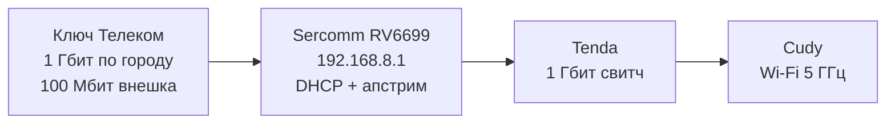

---
title: "Сеть"
---

## Аплинк

У нас подключён Ключ Телеком (с соседнего здания прокинута оптика под окном в хардварной). По Томску линия 1 гигабит, внешка 100 мегабит.

[Личный кабинет для оплаты](https://lk.keytele.com/)

Номер счёта: `36779`

## Локалка

Akiba Hackspace — вайфай от точки доступа, 5 гигагерц, ловит везде

Akiba Hackspace (slow 2.4 GHz) — легаси для устройств которые не умеют в 5 гигагерц (например есп32, включая замок)

Схема подключения (последовательно):

1. Входной роутер Sercomm RV6699 (192.168.8.1). DHCP и апстрим, всё остальное в бридже.
2. Свитч Tenda на 1 гигабит
3. Точка доступа Cudy

